# Forecast-Peak-Ai

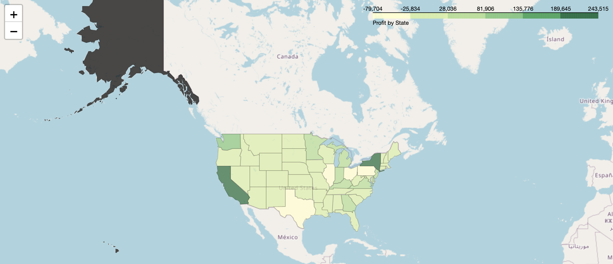

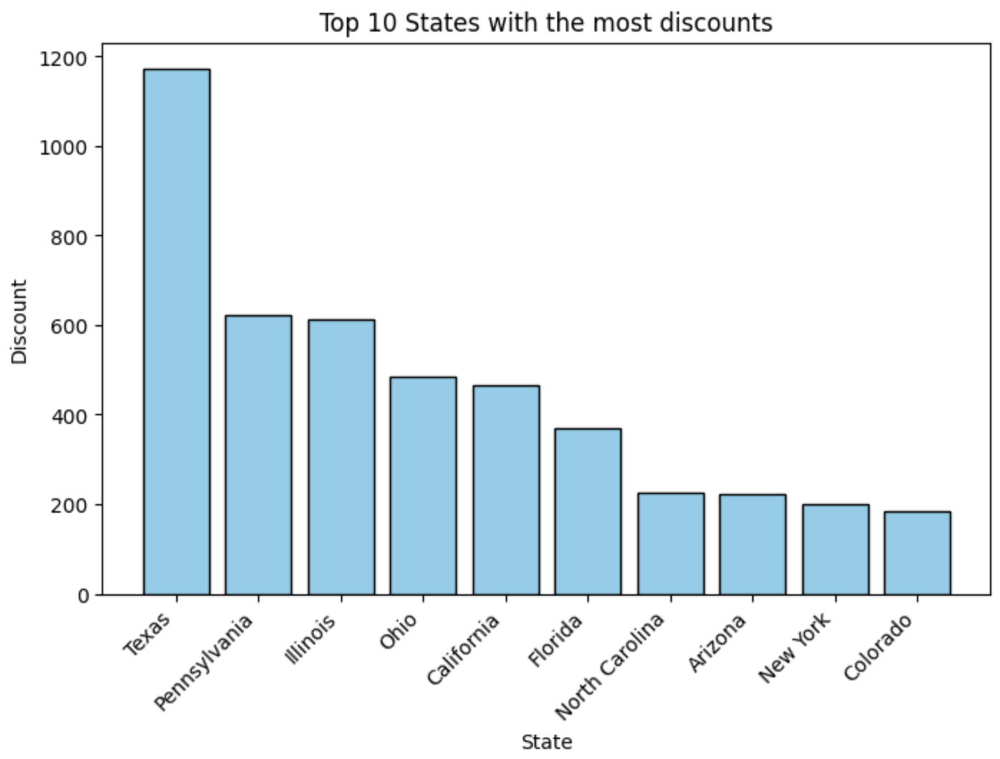

## Foreshadowing
The model that we chose is the ARIMA model for forcasting time series. We did this based on the top 3 most selling products and the top 3 most profitable products. We found tht proucts have missing info so we abstrated data to a monthly sub category basis. We did it for the sub categories of the top 3 most profitibialre and top 3 most selling.

## Limitations of the Model

1. **Data Quality and Volume**:
    - The dataset, which includes columns like `Ship Mode`, `Customer ID`, `Sales`, `Discount`, and others, may contain noise, missing values, or outliers that can impact the accuracy of the model.
    - The limited volume of historical data in columns like `Order Date` and `Sales` can restrict the model's ability to capture long-term trends and seasonality.

2. **Exogenous Variables**:
    - The model includes `Discount` as an exogenous variable, but there could be other significant factors affecting `Sales` and `Profit` that are not considered in the model, such as marketing campaigns, economic conditions, or competitor actions.

3. **Model Assumptions**:
    - ARIMAX models assume linear relationships and may not capture complex non-linear patterns in the data.
    - The model assumes stationarity, which might not hold true for all time series in the dataset.

4. **Hyperparameter Selection**:
    - The chosen parameters for the ARIMAX model (e.g., order (5,1,0)) might not be optimal for all sub-categories like `Copiers`, `Binders`, and `Chairs`. Hyperparameter tuning could improve the model's performance.

5. **Forecast Horizon**:
    - The accuracy of the model's forecasts typically decreases as the forecast horizon increases. The 12-month forecast period may be too long for highly volatile data in categories such as `Sales` and `Profit`.

6. **Aggregation Level**:
    - Daily aggregation of the data can introduce high volatility and noise, making it difficult for the model to capture clear patterns. This can lead to high error rates, especially when there are many zero values.

7. **External Factors**:
    - The model does not account for external factors such as seasonality, holidays, or special events that can significantly impact `Sales` and `Profit`.

### Explanation for Specific Cases

#### Copiers - Sales Forecast
- **High MAPE**: The `Copiers - Sales Forecast` shows a high Mean Absolute Percentage Error (MAPE). This is because the sales data for copiers is highly volatile with significant peaks and troughs, making it difficult for the ARIMAX model to predict accurately. The presence of many zero values in the sales data further complicates the model's ability to learn and forecast effectively.

#### Copiers - Profit Forecast
- **Extremely High MAPE**: The `Copiers - Profit Forecast` exhibits an extremely high MAPE. This is likely due to the low volume of profit data for copiers, which includes many zero values and sporadic high profits. The ARIMAX model struggles to make accurate predictions in such cases because it is unable to capture the underlying patterns effectively. The inclusion of zero values in the profit data significantly affects the accuracy of the MAPE calculation.

### Addressing Zero Values
- **Impact of Zero Values**: Zero values in the `Sales` and `Profit` columns can skew the results of the MAPE calculation, leading to inflated error percentages. These zero values can occur due to periods of no sales or returns, which the model cannot predict accurately.
- **Handling Zero Values**: One way to address this is to add a small constant to the denominator during MAPE calculation, which helps avoid division by zero but doesn't fully resolve the issue of data sparsity. Another approach could be to use alternative evaluation metrics that are less sensitive to zero values, such as Mean Absolute Error (MAE) or Root Mean Squared Error (RMSE).

These limitations should be considered when interpreting the results of the model. Future improvements could include incorporating additional exogenous variables, experimenting with different model types (e.g., machine learning approaches), and increasing the granularity of the data.

## Forecasting with ARIMAX Model

### Why We Chose the ARIMAX Model

The ARIMAX (AutoRegressive Integrated Moving Average with Exogenous variables) model was selected for our forecasting needs due to several compelling reasons:

1. **Handling Seasonality and Trends**:
    - ARIMAX models are adept at handling both seasonality and trends in time series data. Given the cyclical nature of sales and profit data in the retail industry, this feature makes ARIMAX an ideal choice.

2. **Incorporation of Exogenous Variables**:
    - One of the key advantages of the ARIMAX model is its ability to incorporate exogenous variables. In our case, the `Discount` column serves as an exogenous variable, allowing the model to account for external factors influencing sales and profits.

3. **Flexibility and Robustness**:
    - The ARIMAX model is highly flexible, allowing us to adjust parameters such as the order of the autoregressive (AR), differencing (I), and moving average (MA) components. This flexibility enables us to fine-tune the model to better fit our specific data characteristics.

4. **Proven Track Record**:
    - ARIMAX models have a proven track record in various industries, including retail, for accurate forecasting. Their robustness in dealing with time series data makes them a reliable choice.

### Decision-Making Process

The decision to use the ARIMAX model was made after thorough consideration and evaluation of several forecasting models. Our team, composed of data analysts and domain experts, followed these steps:

1. **Exploratory Data Analysis (EDA)**:
    - We conducted an extensive exploratory data analysis to understand the characteristics of our dataset, which includes columns like `Ship Mode`, `Customer ID`, `Sales`, `Discount`, and others.

2. **Evaluation of Different Models**:
    - Various models, including simple exponential smoothing, Holt-Winters seasonal model, and machine learning models, were evaluated. However, these models either lacked the ability to incorporate exogenous variables or did not handle seasonality and trends as effectively as the ARIMAX model.

3. **Model Testing and Validation**:
    - Preliminary tests with the ARIMAX model showed promising results in capturing the underlying patterns in the data. The ability to include the `Discount` variable further strengthened our confidence in this model.

### Aggregation to Sub-Category Level

We chose to aggregate the data to the sub-category level rather than the individual product level due to the following reasons:

1. **Missing Values**:
    - The dataset contained missing values, especially at the individual product level. Aggregating to the sub-category level helped mitigate the impact of these missing values, ensuring a more robust and reliable dataset for modeling.

2. **Data Sparsity**:
    - Individual product data often exhibited sparsity, with many zero values or periods of no sales. Aggregating to the sub-category level provided a more continuous and complete time series, improving the model's ability to learn and forecast.

3. **Better Generalization**:
    - By focusing on sub-categories, we aim to capture broader trends and patterns that are more generalizable across different products within the same category. This approach allows for more accurate and meaningful forecasts.

### Conclusion

In conclusion, the ARIMAX model was chosen for its ability to handle seasonality, incorporate exogenous variables, and its proven track record in forecasting. Aggregating data to the sub-category level helped address issues of missing values and data sparsity, ensuring a more robust dataset for modeling. This approach provides us with reliable and actionable forecasts for informed decision-making.

On Fri, Jun 7, 2024 at 5:03 PM Abdul <alemamsha@gmail.com> wrote:
## Limitations of the Model

1. **Data Quality and Volume**:
    - The dataset, which includes columns like `Ship Mode`, `Customer ID`, `Sales`, `Discount`, and others, may contain noise, missing values, or outliers that can impact the accuracy of the model.
    - The limited volume of historical data in columns like `Order Date` and `Sales` can restrict the model's ability to capture long-term trends and seasonality.

2. **Exogenous Variables**:
    - The model includes `Discount` as an exogenous variable, but there could be other significant factors affecting `Sales` and `Profit` that are not considered in the model, such as marketing campaigns, economic conditions, or competitor actions.

3. **Model Assumptions**:
    - ARIMAX models assume linear relationships and may not capture complex non-linear patterns in the data.
    - The model assumes stationarity, which might not hold true for all time series in the dataset.

4. **Hyperparameter Selection**:
    - The chosen parameters for the ARIMAX model (e.g., order (5,1,0)) might not be optimal for all sub-categories like `Copiers`, `Binders`, and `Chairs`. Hyperparameter tuning could improve the model's performance.

5. **Forecast Horizon**:
    - The accuracy of the model's forecasts typically decreases as the forecast horizon increases. The 12-month forecast period may be too long for highly volatile data in categories such as `Sales` and `Profit`.

6. **Aggregation Level**:
    - Daily aggregation of the data can introduce high volatility and noise, making it difficult for the model to capture clear patterns. This can lead to high error rates, especially when there are many zero values.

7. **External Factors**:
    - The model does not account for external factors such as seasonality, holidays, or special events that can significantly impact `Sales` and `Profit`.

### Explanation for Specific Cases

#### Copiers - Sales Forecast
- **High MAPE**: The `Copiers - Sales Forecast` shows a high Mean Absolute Percentage Error (MAPE). This is because the sales data for copiers is highly volatile with significant peaks and troughs, making it difficult for the ARIMAX model to predict accurately. The presence of many zero values in the sales data further complicates the model's ability to learn and forecast effectively.

#### Copiers - Profit Forecast
- **Extremely High MAPE**: The `Copiers - Profit Forecast` exhibits an extremely high MAPE. This is likely due to the low volume of profit data for copiers, which includes many zero values and sporadic high profits. The ARIMAX model struggles to make accurate predictions in such cases because it is unable to capture the underlying patterns effectively. The inclusion of zero values in the profit data significantly affects the accuracy of the MAPE calculation.

### Addressing Zero Values
- **Impact of Zero Values**: Zero values in the `Sales` and `Profit` columns can skew the results of the MAPE calculation, leading to inflated error percentages. These zero values can occur due to periods of no sales or returns, which the model cannot predict accurately.
- **Handling Zero Values**: One way to address this is to add a small constant to the denominator during MAPE calculation, which helps avoid division by zero but doesn't fully resolve the issue of data sparsity. Another approach could be to use alternative evaluation metrics that are less sensitive to zero values, such as Mean Absolute Error (MAE) or Root Mean Squared Error (RMSE).

These limitations should be considered when interpreting the results of the model. Future improvements could include incorporating additional exogenous variables, experimenting with different model types (e.g., machine learning approaches), and increasing the granularity of the data.

## Product Analysis

Calculated the sales and profit for each category, sub category and product. Using this data we also calculated the top 5 products in terms of its profit markup in relation to total sale value.

We split the dataset into each year in order to analyse seasonal trends. Subsequently, we plotted the average discount of each 5 days in order to better visualise the data. In areas that had higher discounts, we found the dates and created an updated dataset that showed sales and profit before, during and after each discount period.

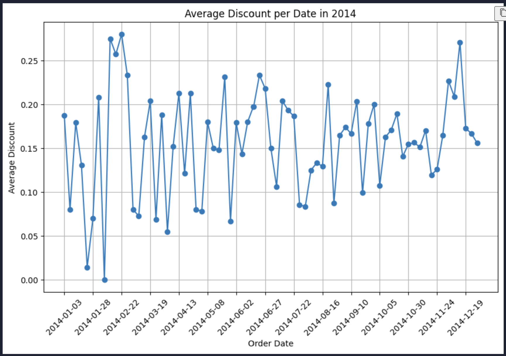

We analysed the profit on each product with and without discounts, in order to analyse how much effective profit was actually made, or if discounts incurred a loss of profit that was not recouped in terms of total sale.

After analysising the segments of products, we can analyse which are sold more and generate more profit

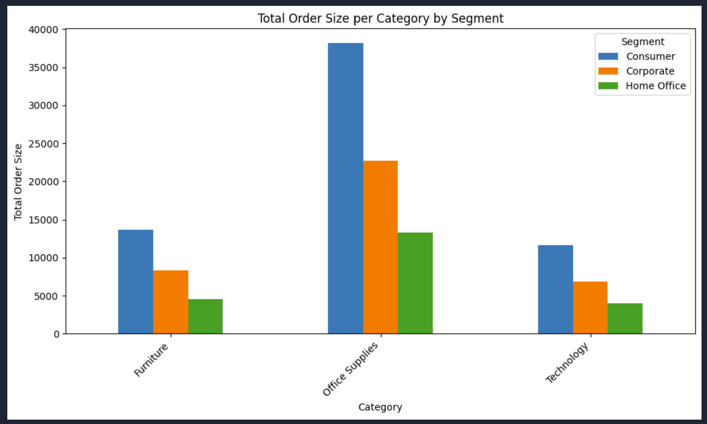

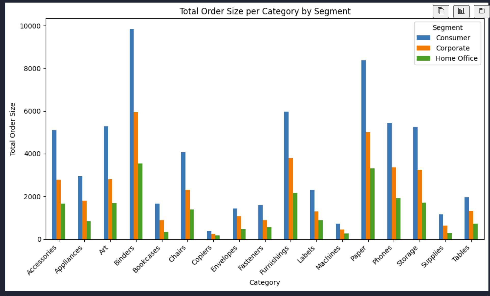
## Shipping methods

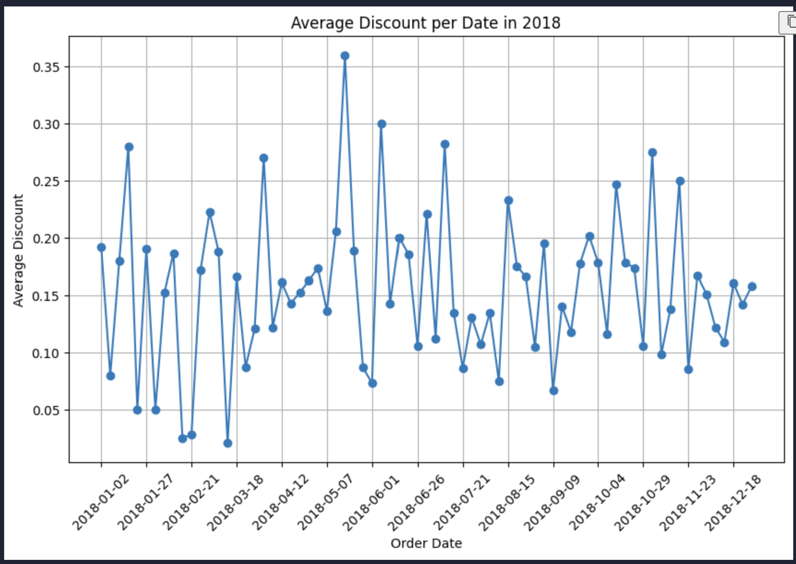
We analaysed the shipping method used by customers when there was a discount compared to no discount. In 3 of the 4 categories, a discount produced more orders. This was further analysed by other sources. We also analysed the total profits for each shipping method to see the desired method for customers.
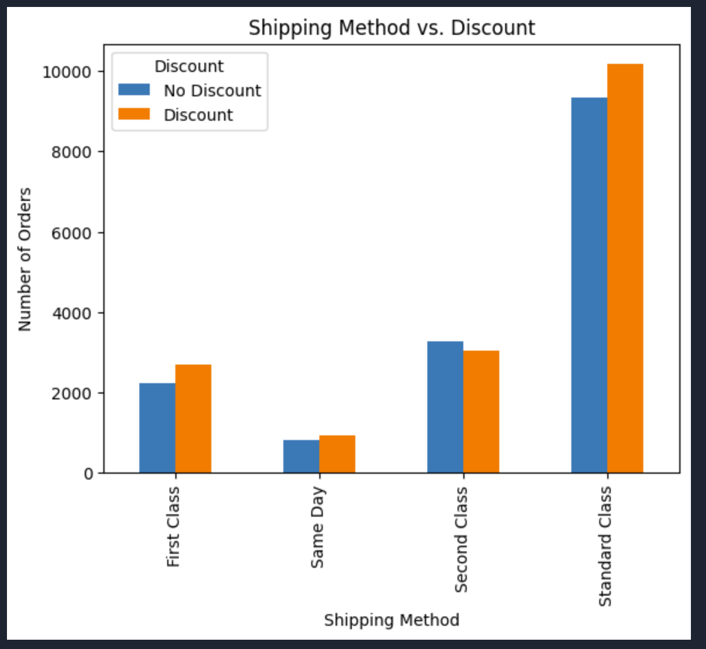

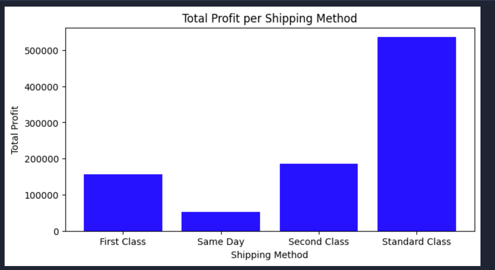

## Customer Analysis

We calculated which customers generated the most profit for the company by separating the dataset into a unique set, and aggregating the profit figures.

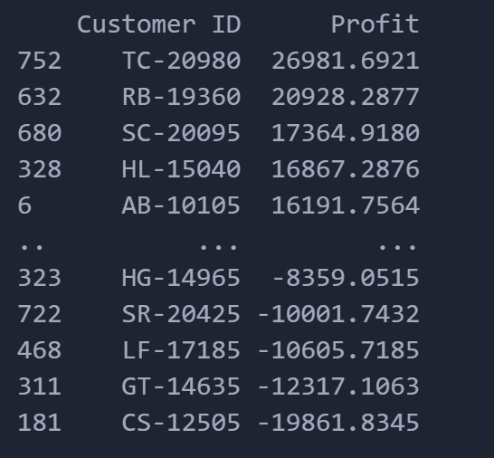

We then looked at the profit for each customer with and without discounts. This shows us how much of an effect saving money via discount affects the users' likeliness to buy products.

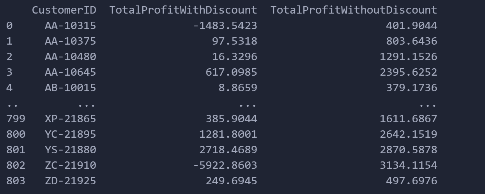

After finding the most frequent customers that visited the store, this enables us to examine future trends in the data and extract business insights.

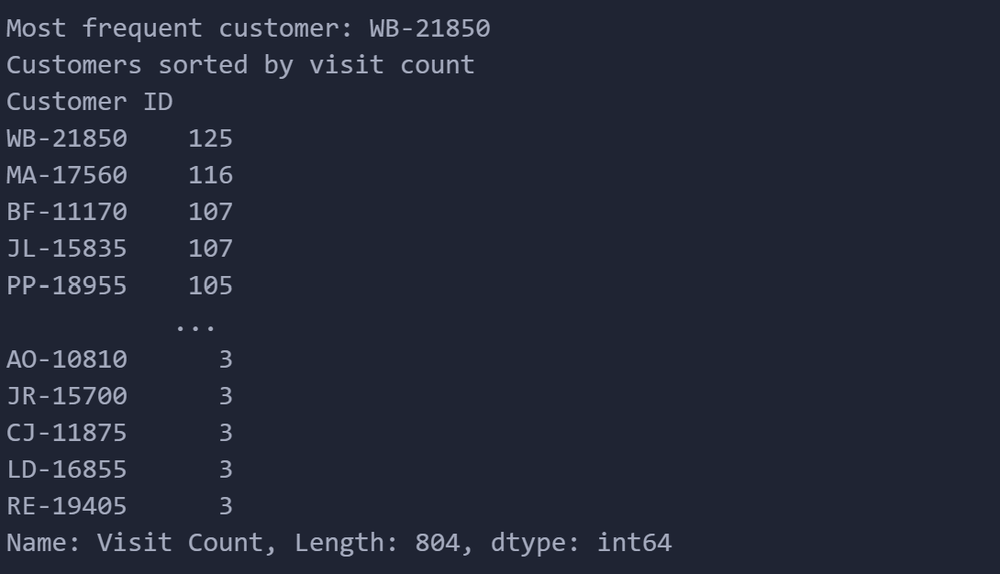